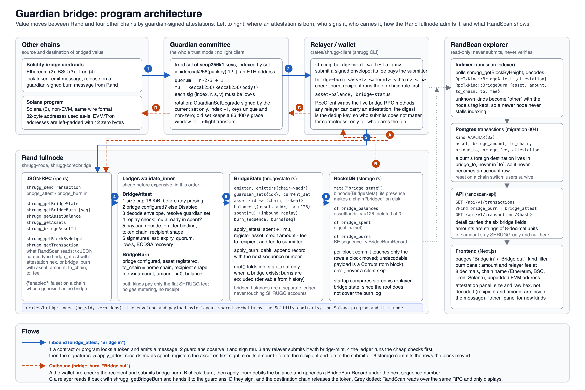
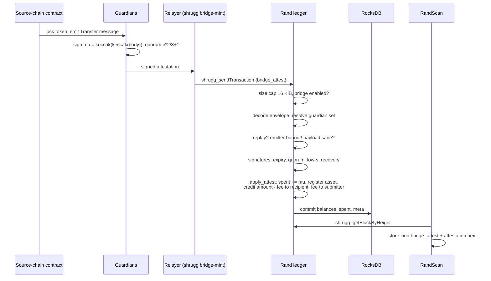

# The guardian bridge: architecture

How value moves between Rand and other chains, how the Rand fullnode admits and records bridge
transactions, and what RandScan indexes and shows for them. This is the explorer-side reference;
the authoritative description of the node is `docs/bridge.md` in the fullnode repository, which
this page condenses and extends with the RandScan surface. Describes fullnode `dbea18c` (bridge
merge plus the attestation check reordering in `273e13d`) and RandScan migration 004.



The same diagram is in `bridge-architecture.svg`; regenerate the PNG with

```
"/Applications/Google Chrome.app/Contents/MacOS/Google Chrome" --headless=new --disable-gpu \
  --hide-scrollbars --force-device-scale-factor=2 --window-size=1500,1000 \
  --screenshot=docs/bridge-architecture.png "file://$PWD/docs/bridge-architecture.svg"
```

## 1. What the bridge is

The bridge is a **guardian-attestation bridge** in the Wormhole shape. A fixed committee of
guardians watches five chains, and a quorum of their ECDSA signatures over a message is the only
thing Rand verifies. Nothing on Rand verifies a source-chain header, state proof, or light
client; if the committee lies, Rand believes it.

| Chain | Bridge chain id | Family | Bridge program |
|---|---|---|---|
| Rand | 1 | this fullnode | `shrugg-core::bridge` |
| Ethereum | 2 | EVM | Solidity contract |
| BSC | 3 | EVM | Solidity contract |
| Tron | 4 | EVM-compatible | Solidity contract |
| Solana | 5 | non-EVM | Solana program |

All five share one wire format, `crates/bridge-codec`, so a message signed for one chain is
byte-identical everywhere it is verified.

Two directions, two transaction kinds on Rand:

- **Inbound** (`bridge_attest`, shown as "Bridge in"): a token is locked on another chain, the
  guardians sign a `Transfer` attestation, anyone submits it to Rand, and Rand mints the bridged
  asset to the recipient named inside the message.
- **Outbound** (`bridge_burn`, shown as "Bridge out"): a Rand account burns bridged units and the
  node appends an outbound message; the guardians sign that message and the destination chain
  releases the token.

The same attestation format also carries **guardian-set rotations** (`GuardianSetUpgrade`), which
are inbound transactions from a reserved governance emitter.

## 2. Program architecture

The diagram above reads left to right along the inbound path and right to left along the
outbound one. The components, and which repository owns each:

| Component | Where | Role |
|---|---|---|
| Solidity contracts, Solana program | separate bridge repository | lock and release tokens; emit and consume attestations |
| Guardian committee | off-chain operators | observe events, sign the double-keccak digest of the body |
| `bridge-codec` | fullnode `crates/bridge-codec` | `no_std`, zero-dependency byte layout for envelope and payloads; hashing and ECDSA are injected by the caller so it ports to every verifier |
| `shrugg-core::bridge` | fullnode `crates/shrugg-core/src/bridge` | `verify` (signatures), `BridgeState` (state and root), `check_attest` / `check_burn` / `apply_*` |
| `Ledger` | fullnode `crates/shrugg-core/src/ledger.rs` | admission order for both kinds, fee debit, state root composition |
| Storage | fullnode `crates/shrugg-node/src/storage.rs` | three RocksDB column families plus a meta blob; replay and integrity check |
| JSON-RPC | fullnode `crates/shrugg-node/src/rpc.rs` | submission plus five bridge query methods |
| Wallet | fullnode `crates/shrugg-client` | `bridge-mint`, `bridge-burn`, `asset-balance`, `bridge-status` |
| RandScan | this repository | indexes both kinds from blocks, stores the six bridge fields, serves and renders them; never submits, never verifies |

Relayers are not a component with code of their own. Any party holding a signed attestation can
submit it; the digest is the dedup key, so who submits only decides who collects the relayer fee.

## 3. Trust model

- **Guardian identity** is an Ethereum-style address: the last 20 bytes of
  `keccak256(uncompressed_pubkey[1..])`. The same key and address work in the EVM contracts, the
  Solana program, and Rand.
- **Quorum** for a set of size `n` is `n*2/3 + 1`.
- **Digest** guardians sign is `mu = keccak256(keccak256(body_bytes))`, computed over the body
  bytes exactly as they arrived on the wire, never over a re-encoding.
- **Signatures** are secp256k1 `(index, r, s, v)` and must be low-s (`s <= n/2`); a high-s
  signature is rejected outright, which forecloses malleability.
- **Governance emitter** is a fixed non-guardian address, `keccak256("rand-bridge-governance")`.
  Only a `GuardianSetUpgrade` may claim it, and only as `(CHAIN_RAND, GOVERNANCE_EMITTER)`.

What this does not protect against: a colluding quorum can mint arbitrary value or push an
illegitimate rotation, and nothing on Rand detects it. The one hardening against a *partially*
compromised committee is the rotation rule in section 5.

## 4. Wire format

`crates/bridge-codec` is the single source of truth. Every integer is big-endian. The wire
version is 1; any other value fails decoding.

**Signature, 66 bytes:** `index` (1) · `r` (32) · `s` (32) · `v` (1).

**Body header, 51 bytes, then the payload:**

| Offset | Len | Field |
|---|---|---|
| 0 | 4 | `timestamp` |
| 4 | 4 | `nonce` |
| 8 | 2 | `emitter_chain` |
| 10 | 32 | `emitter_address` |
| 42 | 8 | `sequence` |
| 50 | 1 | `consistency_level` |
| 51 | .. | `payload` |

**Envelope:** `version` (1) · `guardian_set_index` (4) · `n_sigs` (1) · `signatures[]`
(`66*n_sigs`) · `body`.

**`Transfer` payload, id 1, fixed 133 bytes:** `amount` (u256) · `token_address` (32) ·
`token_chain` (2) · `to` (32) · `to_chain` (2) · `fee` (u256). Rand unpacks only the low 128
bits of `amount` and `fee`; a non-zero top half is `AmountOverflow`.

**`GuardianSetUpgrade` payload, id 2:** `new_index` (4) · `n` (1) · `keys[]` (`20*n`). The codec
rejects zero guardians, truncation, and trailing bytes; sequencing and uniqueness are the
ledger's job.

**Address padding.** `to`, `token_address`, and `emitter_address` are 32-byte slots on every
chain. Ethereum, BSC, and Tron addresses are 20 bytes, left-padded with 12 zero bytes. The codec
does not enforce that; `check_burn` on the node and `check_burn_recipient` in the wallet do, on
the way out (non-zero padding on chains 2, 3, 4 is `BadRecipient`; an all-zero `to` is
`BadRecipient` everywhere). RandScan strips the padding when it displays an EVM destination.

## 5. Guardian sets and rotation

Genesis installs the configured keys as set 0, never expiring. A rotation is a
`GuardianSetUpgrade` attestation that must satisfy, in `check_attest`:

- emitter is exactly `(CHAIN_RAND, GOVERNANCE_EMITTER)`;
- `new_index == current_set + 1`, no skipping;
- keys non-empty, unique, non-zero;
- **the attestation's `guardian_set_index` equals `current_set`**, not merely some still-unexpired
  set. Without this a set just rotated away from could use its grace window to sign another
  rotation and retake the bridge for a day.

Applying it gives the old set `expires_at = now + 86 400 s`, so in-flight transfers it signed
stay valid for a day, installs the new set with no expiry, and advances `current_set`. Expiry is
judged against block time, not wall clock, which is why a bridged chain rejects a block whose
timestamp precedes its parent's and why proposers emit `max(now, parent.timestamp)`.

## 6. On-chain state and the state root

`BridgeState` holds:

| Field | Meaning |
|---|---|
| `emitter` | Rand's own outbound emitter address, stamped into burn messages |
| `emitters` | registered emitter per source chain |
| `guardian_sets`, `current_set` | every set ever seen, and the authoritative index |
| `assets` | registry `AssetId -> (home chain, token address)`, filled lazily on first mint |
| `balances` | `(AssetId, Address) -> u128`, a ledger separate from SHRUGG accounts |
| `spent` | consumed attestation digests, the inbound replay guard |
| `burn_sequence`, `burns` | next outbound sequence and every outbound record |

`AssetId = blake3("shrugg-bridge-asset" || token_chain || token_address)`, a pure function that
any node can answer even without a bridge (`shrugg_bridgeAssetId`).

`root()` commits the emitters and guardian sets, a Merkle root of non-zero balances, a Merkle root
of the asset registry, a Merkle root of the sorted spent digests, and `burn_sequence`. It
deliberately excludes `burns`, which is derivable from history. The bridge root is appended to the
chain's state root only when genesis has a bridge section, so a bridge-less chain commits exactly
what a pre-bridge node did. The root of a fixed fixture is pinned by a test; changing it is a
hard fork for every bridged chain.

## 7. Transactions

Two `TxKind` variants, appended after `Call` so earlier tags keep their encoding:

| Tag | Kind | Fields | Node JSON `type` |
|---|---|---|---|
| 4 | `BridgeAttest` | `attestation: Vec<u8>` | `bridge_attest` with `attestation` hex |
| 5 | `BridgeBurn` | `asset, amount: u128, to_chain: u16, to: [u8; 32], fee: u128` | `bridge_burn` with `asset`, `amount`, `to_chain`, `to`, `fee` |

Both pay only the flat SHRUGG fee. There is no gas metering because the value moved is a bridged
asset, and there is no receipt.

### Inbound: `bridge_attest`



Admission runs cheap checks before expensive ones, in this order:

1. `attestation.len() > 16 KiB` is rejected before a byte is parsed. A guardian set is at most 255
   keys, so anything larger is malformed by construction and must not buy verification work with
   a zero fee.
2. A chain without a bridge section rejects with `Disabled`.
3. `check_attest` decodes the envelope once, resolves the guardian set (`UnknownGuardianSet`),
   then runs every cheap check: replay against `spent`, payload decode (`BadPayload`), emitter
   binding (`WrongEmitter`), `token_chain == emitter_chain` (`WrongTokenChain`), recipient shape.
4. Only an attestation passing all of that reaches signature work: set expiry, index order and
   quorum, low-s, ECDSA recovery.

`apply_attest` records `mu` in `spent` before any effect, registers the asset if unseen, and
credits `amount - fee` to the recipient and `fee` to the submitting account. The relayer fee is
in the bridged asset; the transaction fee is in SHRUGG.

### Outbound: `bridge_burn`

```mermaid
sequenceDiagram
    participant W as Wallet (shrugg bridge-burn)
    participant L as Rand ledger
    participant S as RocksDB
    participant R as Relayer
    participant G as Guardians
    participant D as Destination contract
    participant X as RandScan
    W->>W: check_burn_recipient (same rule as the node)
    W->>L: shrugg_sendTransaction {bridge_burn}
    L->>L: bridge enabled, asset registered, to_chain = home chain,<br/>recipient shape, fee <= amount, amount != 0, balance
    L->>L: apply_burn: debit, append BridgeBurnRecord(sequence)
    L->>S: commit balance row, burn row
    R->>L: shrugg_getBridgeBurn [sequence]
    R->>G: outbound message
    G->>D: signed message; token released
    X->>L: shrugg_getBlockByHeight
    X->>X: store asset, bridge_amount, to_chain, bridge_to, bridge_fee
```

`check_burn` order: registered asset, `to_chain` equal to the asset's home chain, recipient shape,
`fee <= amount`, `amount != 0`, sufficient balance. `apply_burn` debits and appends a record under
a strictly increasing `burn_sequence`.

### Replay protection

- Inbound is **digest-based**: `spent` holds every consumed `mu`. There is no sequence, because
  the same attestation can arrive through any relayer.
- Outbound is **sequence-based**: `burn_sequence` increases by one per burn.

### Undecodable payloads

An attestation whose payload does not decode is a hard error at both layers: `BadPayload` at
admission, and a storage `Corrupt` error on the commit path. It used to fall through silently and
leave disk disagreeing with memory.

## 8. Storage, RPC, wallet

**Storage.** Three RocksDB column families and one meta key:

| Where | Key | Value |
|---|---|---|
| `meta["bridge_state"]` | | `bincode(BridgeMeta)`: everything except balances, spent, burns. Its presence makes a chain "bridged" on disk |
| `bridge_balances` | `asset || address` | `bincode(u128)`; row deleted at zero |
| `bridge_spent` | digest | empty (a set) |
| `bridge_burns` | big-endian sequence | `bincode(BridgeBurnRecord)` |

A per-block commit touches only the rows the block moved. Startup compares the stored bridge with
the replayed one separately from the state root, because the root does not cover the burn log.

**RPC.** Five bridge methods, next to the general ones RandScan uses:

| Method | Params | Result |
|---|---|---|
| `shrugg_getAssetBalance` | `[address, asset]` | decimal string of 8-decimal units, `"0"` if unknown |
| `shrugg_getAssets` | `[address]` | every non-zero bridged asset held |
| `shrugg_getBridgeState` | `[]` | emitter, emitter table, guardian set, assets, `burn_sequence`; `{"enabled": false}` without a bridge |
| `shrugg_getBridgeBurn` | `[sequence]` | one outbound record or `null` |
| `shrugg_bridgeAssetId` | `[token_chain, token_address]` | the asset id; answers on any chain |

**Wallet.** `shrugg bridge-mint <attestation>` (hex or `@path`), `shrugg bridge-burn <asset>
<amount> <to_chain> <to> [--bridge-fee]`, `shrugg asset-balance [address] <asset>`, `shrugg
bridge-status`. `check_burn_recipient` applies the node's recipient rule before signing.

## 9. What RandScan does with the bridge

RandScan is a reader. It never submits an attestation, never verifies a signature, and never
calls the five bridge RPC methods. It indexes both kinds from block bodies and shows them.

### Indexer

`shrugg_getBlockByHeight` returns each transaction with a tagged `kind`. The indexer decodes
`bridge_attest {attestation}` and `bridge_burn {asset, amount, to_chain, to, fee}` into
`RpcTxKind::BridgeAttest` and `RpcTxKind::BridgeBurn`
(`crates/randscan-indexer/src/rpc.rs`). Any tag it does not know becomes `RpcTxKind::Unknown`
and is stored as kind `other` with the node's tag kept verbatim, so a node newer than the
explorer never stalls indexing.

`TxFields` (`crates/randscan-indexer/src/processor.rs`) maps a burn's foreign destination to
`bridge_to`, never to `to_address`. The `to` column only ever holds a SHRUGG address, so a
destination on Ethereum never becomes an account row.

### Schema (migration 004)

```sql
ALTER TABLE transactions ALTER COLUMN kind TYPE VARCHAR(32);   -- also holds unknown node tags
ALTER TABLE transactions
    ADD COLUMN asset         VARCHAR(64),      -- bridge_burn: asset id (hex)
    ADD COLUMN bridge_amount NUMERIC(40,0),    -- bridge_burn: bridged units (8 decimals)
    ADD COLUMN to_chain      INTEGER,          -- bridge_burn: destination chain id
    ADD COLUMN bridge_to     VARCHAR(64),      -- bridge_burn: destination address, 32 bytes hex
    ADD COLUMN bridge_fee    NUMERIC(40,0),    -- bridge_burn: relayer fee, bridged units
    ADD COLUMN attestation   TEXT;             -- bridge_attest: signed message, hex
```

These are chain tables. A chain switch (new chain id or genesis) truncates and re-indexes them;
users, sessions, and API keys survive.

### API

`GET /api/v1/transactions?kind=bridge_attest` and `?kind=bridge_burn` filter the list.
`GET /api/v1/transactions/{hash}` returns the detail with:

| Kind | `to` / `amount` | Bridge fields |
|---|---|---|
| `bridge_attest` | null | `attestation` (hex of the signed message) |
| `bridge_burn` | null | `asset`, `bridge_amount`, `to_chain`, `bridge_to`, `bridge_fee` |

`bridge_amount` and `bridge_fee` are strings of **8-decimal** bridged units, not SHRUGG's 9.
`bridge_to` is 32 bytes of hex with EVM and Tron addresses left-padded. See `docs/api.md`.

### Frontend

- List badges "Bridge in" and "Bridge out" and a kind filter for both.
- Burn panel: amount and relayer fee formatted at 8 decimals with raw units alongside, chain name
  from the id (Rand, Ethereum, BSC, Tron, Solana, or "chain N"), and the destination with EVM
  padding stripped.
- Attestation panel: size and the raw hex behind a disclosure. The explorer does not decode the
  envelope, so recipient and amount are not shown; they are inside the message.
- An "other" panel for kinds this build does not know.

### Tests

`crates/randscan-api/tests/mock_node.rs` runs a scripted node that serves both bridge kinds, an
unknown kind, a 2000-transaction block, and two hard forks under a running indexer.
`crates/randscan-db/tests/chain_reset.rs` inserts a `bridge_burn` with the new columns and checks
a reset keeps users. The real-node test does not exercise the bridge, because a bridged chain
needs a guardian-signed attestation; the fullnode's `bridge_mint_reaches_every_node` cluster
test covers that path on the node side.

## 10. Test vectors on the node

`crates/shrugg-core/src/bridge/vectors.json` in the fullnode holds 39 vectors generated by the
bridge repository's `tools/vectors` and copied in verbatim. Two tests pin them with exact
counts: 23 at the signature level (`ok`, `no_quorum`, `index_order`, `high_s`, `wrong_guardian`,
`set_expired`, `bad_version`, and so on) and 21 at the ledger level through a real
`BridgeAttest` (`wrong_emitter`, `wrong_to_chain`, `fee_exceeds_amount`, `replay`,
`stale_governance_set`, and so on). The `ok` cases pin exact digests, so the keccak and quorum
math cannot drift silently.

## 11. Known gaps

Stated in the node's own code comments and commit messages:

- Equal-to-parent block timestamps are allowed. A colluding two thirds of leaders can hold the
  timestamp constant, which freezes burn timestamps and keeps a superseded guardian set inside its
  grace window indefinitely.
- `BridgeState.burns` is unbounded and kept whole in memory, and is cloned on every speculative
  block execution. Draining it into storage per block is planned before about 100k burns.
- No light client or on-chain verification of source-chain state exists or is planned.
- No bridge-specific rate limiting beyond the flat SHRUGG fee and the 16 KiB attestation cap.

Explorer-side:

- The attestation is stored and shown as opaque hex. Decoding the envelope in the explorer
  (guardian set index, signature count, payload type, recipient, amount) would need a port of
  `bridge-codec`'s layout to the API and is not done.
- Bridged balances per account are not shown. The node serves them through
  `shrugg_getAssetBalance` and `shrugg_getAssets`, which the explorer does not call.

## 12. Relationship to the confidential layer and the shielded chain

Today, none. Neither `bridge-codec` nor `shrugg-core::bridge` imports anything from the zkVM or
the confidential executor; the two areas share only the ledger, the state root machinery, and the
gas-limits module where `MAX_ATTESTATION_BYTES` sits next to `MAX_PROOF_BYTES`. Bridged balances
are plain visible state.

On the planned shielded chain (fullnode spec
`docs/superpowers/specs/2026-09-11-shielded-pool-design.md`, phase S3) bridged assets become
notes with `asset = bridge asset id`. `BridgeAttest` deposits a note whose amount is public in
that one transaction; `BridgeBurn` burns from a bundle in that asset and, because the fee is in
SHRUGG and a bundle balances one asset, is the only two-bundle transaction. The bridge's own
state (emitters, guardian sets, asset registry, spent digests, burn log) stays public; its
per-account balances are deleted. When that lands, RandScan keeps the attestation and burn
panels and loses nothing it shows today, since it never showed bridged balances.

## Sources

- fullnode `docs/bridge.md`, `docs/rpc.md`, `docs/cli.md`
- fullnode `crates/bridge-codec/src/{lib,envelope,payload}.rs`
- fullnode `crates/shrugg-core/src/bridge/{mod,state}.rs`, `src/ledger.rs`, `src/gas.rs`
- fullnode `crates/shrugg-node/src/{rpc,storage}.rs`
- RandScan `crates/randscan-indexer/src/{rpc,processor}.rs`, `migrations/004_bridge_and_chain_id.sql`,
  `docs/api.md`, `frontend/src/lib/utils.ts`, `frontend/src/app/transactions/[hash]/page.tsx`
